# Agentic Context Engine (ACE)


[](https://badge.fury.io/py/ace-framework)
[](https://www.python.org/downloads/)
[](tests/)
[](docs/Fortune100.md)


**The only AI agent framework that actually learns from experience.**

Cursor doesn't learn. Copilot doesn't learn. Cody doesn't learn. **ACE does.**

Star this repo if you want agents that get smarter, not just faster.

---

## LLM Quickstart
1. Direct your favorite coding agent (Cursor, Claude Code, Codex, etc) to [Quick Start Guide](docs/QUICK_START.md)
2. Prompt away!

---

## MCP Server Integration (VS Code Copilot, Claude Desktop, Cursor)

ACE provides an MCP (Model Context Protocol) server for IDE integration, enabling AI agents to retrieve and store memories across sessions.

### Step 1: Prerequisites

```bash
# Install ACE with MCP support
pip install ace-framework mcp

# Start Qdrant (vector database)
docker run -d -p 6333:6333 qdrant/qdrant
```

### Step 2: Configure Your IDE

**VS Code / GitHub Copilot** - Add to `.vscode/mcp.json` or VS Code settings:

```json
{
  "mcpServers": {
    "ace": {
      "command": "python",
      "args": ["/path/to/agentic-context-engine/ace_mcp_server.py"],
      "type": "stdio"
    }
  }
}
```

**Claude Desktop** - Add to `~/Library/Application Support/Claude/claude_desktop_config.json`:

```json
{
  "mcpServers": {
    "ace": {
      "command": "python",
      "args": ["/path/to/agentic-context-engine/ace_mcp_server.py"]
    }
  }
}
```

**Cursor** - Add to MCP settings:

```json
{
  "ace": {
    "command": "python",
    "args": ["/path/to/ace_mcp_server.py"],
    "transport": "stdio"
  }
}
```

### Step 3: Onboard Your Workspace

When you first use ACE in a workspace, it automatically:
1. Creates `.ace/.ace.json` configuration
2. Indexes all code files for semantic search
3. Creates a workspace-specific Qdrant collection

You can also manually onboard: call the `ace_onboard` tool or run:
```bash
python -c "from ace.code_indexer import CodeIndexer; CodeIndexer().index_workspace('/path/to/workspace')"
```

### Step 4: Add ACE Instructions to Your Agent

Add these instructions to your agent's instruction file (e.g., `copilot-instructions.md`, `.cursorrules`, or Claude system prompt):

```markdown
# ACE Memory System Usage

## Available ACE MCP Tools

| Tool | Purpose | When to Use |
|------|---------|-------------|
| `mcp_ace_ace_retrieve` | Get relevant memories | **FIRST tool call on every prompt** |
| `mcp_ace_ace_store` | Save lessons/preferences | After learning something new |
| `mcp_ace_ace_search` | Filtered memory search | Find specific categories |
| `mcp_ace_ace_stats` | View memory statistics | Debug/monitoring |
| `mcp_ace_ace_tag` | Mark memories helpful/harmful | Improve retrieval quality |

## Mandatory ACE Protocol

1. **BEFORE every task**: Call `mcp_ace_ace_retrieve(query="<task keywords>")` to get relevant context
2. **When user corrects you**: Call `mcp_ace_ace_store(content="<lesson>", category="CORRECTION")`
3. **When user expresses preference**: Call `mcp_ace_ace_store(content="<preference>", category="PREFERENCE", severity=8)`
4. **After completing complex tasks**: Store lessons learned with `ace_store`

## ACE Trigger Words

Auto-retrieve when user says: "recurring", "again", "same issue", "last time", "remember", "we discussed"
Auto-store when user says: "I prefer", "always", "never", "remember this"

## Memory Categories

| Category | Severity | Use For |
|----------|----------|---------|
| DIRECTIVE | 9-10 | Critical rules that must be followed |
| CORRECTION | 7-8 | Mistakes to avoid in future |
| PREFERENCE | 6-8 | User style/tool preferences |
| WORKFLOW | 5-6 | Process patterns |
| ARCHITECTURE | 5-6 | Design decisions |
| DEBUGGING | 5-6 | Bug fix patterns |

## Example Usage

```
# Before starting work
mcp_ace_ace_retrieve(query="authentication error handling patterns")

# After user corrects you
mcp_ace_ace_store(
  content="Always validate JWT tokens before database calls",
  category="CORRECTION",
  severity=8
)

# Store user preference
mcp_ace_ace_store(
  content="User prefers TypeScript over JavaScript for all new code",
  category="PREFERENCE", 
  severity=7
)
```
```

### ACE MCP Tools Reference

| Tool | Parameters | Description |
|------|------------|-------------|
| `ace_retrieve` | `query`, `namespace?`, `limit?` | Semantic search for relevant memories |
| `ace_store` | `content`, `namespace?`, `category?`, `severity?` | Store new memory with deduplication |
| `ace_search` | `query`, `category?`, `min_severity?`, `limit?` | Filtered search by category/severity |
| `ace_stats` | none | Get collection statistics |
| `ace_tag` | `memory_id`, `tag` | Mark memory as helpful/harmful |

**Namespaces**: `user_prefs`, `task_strategies`, `project_specific`, `all`

See [MCP Integration Guide](docs/MCP_INTEGRATION.md) for complete documentation.

---

## Quick Start (Python SDK)

### 1. Install

```bash
pip install ace-framework
```

### 2. Set API Key

**ACE uses Z.ai GLM-4.7 by default** (best quality, 2 concurrency limit):

```bash
export ZAI_API_KEY="your-zai-api-key"
```

Or use OpenAI instead:
```bash
export OPENAI_API_KEY="your-openai-api-key"
```

### 3. Run

```python
from ace import ACELiteLLM

# Default: Uses Z.ai GLM-4.7 (requires ZAI_API_KEY)
agent = ACELiteLLM()

# Alternative: Use OpenAI (requires OPENAI_API_KEY)
# agent = ACELiteLLM(model="gpt-4o-mini")

answer = agent.ask("What does Agentic Context Engine do?")
print(answer)  # "ACE allows AI agents to remember and learn from experience!"
```

Done! Your agent learns automatically from each interaction.

---

## LLM Configuration

**IMPORTANT:** ACE defaults to Z.ai GLM-4.7. Configure your `.env` file:

| Provider | Environment Variable | Model Name | Notes |
|----------|---------------------|------------|-------|
| **Z.ai GLM (Default)** | `ZAI_API_KEY` | `glm-4.7` | Default, best quality (2 concurrency limit) |
| OpenAI | `OPENAI_API_KEY` | `gpt-4o-mini` | Pass `model="gpt-4o-mini"` explicitly |
| Anthropic | `ANTHROPIC_API_KEY` | `claude-3-haiku-20240307` | Pass model explicitly |
| Google | `GOOGLE_API_KEY` | `gemini/gemini-pro` | Pass model explicitly |

**Example with explicit model:**
```python
# Z.ai GLM (default - no model param needed)
agent = ACELiteLLM()

# OpenAI
agent = ACELiteLLM(model="gpt-4o-mini")

# Anthropic
agent = ACELiteLLM(model="claude-3-haiku-20240307")
```

---

## 🎯 Integrations

ACE provides three ready-to-use integrations:

### **ACELiteLLM** - Simplest Start

Perfect for Q&A, classification, reasoning:

```python
from ace import ACELiteLLM

# Create self-improving agent (uses Z.ai GLM-4.7 by default)
agent = ACELiteLLM()  # Requires ZAI_API_KEY
# Or: agent = ACELiteLLM(model="gpt-4o-mini")  # Requires OPENAI_API_KEY

# Ask related questions - agent learns patterns
answer1 = agent.ask("If all cats are animals, is Felix (a cat) an animal?")
answer2 = agent.ask("If all birds fly, can penguins (birds) fly?")  # Learns to check assumptions!
answer3 = agent.ask("If all metals conduct electricity, does copper conduct electricity?")

# View learned strategies
print(f"✅ Learned {len(agent.playbook.bullets())} reasoning strategies")

# Save for reuse
agent.save_playbook("my_agent.json")

# Load and continue
agent2 = ACELiteLLM.from_playbook("my_agent.json", model="gpt-4o-mini")
```

### **ACEAgent (browser-use)** - Browser Automation

Self-improving browser agents with [browser-use](https://github.com/browser-use/browser-use):

```bash
pip install ace-framework[browser-use]
```

```python
from ace import ACEAgent
from browser_use import ChatBrowserUse

# Two LLMs: ChatBrowserUse for browser, Z.ai GLM for ACE learning (default)
agent = ACEAgent(
    llm=ChatBrowserUse(),  # Browser execution (separate LLM)
    # ace_model defaults to "openai/glm-4.6" (requires ZAI_API_KEY)
)

await agent.run(task="Find top Hacker News post")
agent.save_playbook("hn_expert.json")

# Reuse learned knowledge
agent = ACEAgent(llm=ChatBrowserUse(), playbook_path="hn_expert.json")
await agent.run(task="New task")  # Starts smart!
```

**Features:** Drop-in replacement for `browser_use.Agent`, automatic learning, reusable playbooks
**[→ Browser Use Guide](examples/browser-use/README.md)**

### **ACELangChain** - Complex Workflows ⛓️

Wrap any LangChain chain/agent with learning:

```python
from ace import ACELangChain

ace_chain = ACELangChain(runnable=your_langchain_chain)
result = ace_chain.invoke({"question": "Your task"})  # Learns automatically
```

**Best for:** Multi-step workflows, tool-using agents

**[→ Integration Guide](docs/INTEGRATION_GUIDE.md)** | **[→ Examples](examples/)**

---

## Why ACE? (The Honest Comparison)

### The Problem Everyone Ignores

AI agents make the **same mistakes repeatedly**. Your coding assistant suggests the same broken pattern. Your browser agent clicks the same wrong button. Your workflow agent takes the same inefficient path.

**Why?** Because today's tools optimize for *speed*, not *learning*.

### How ACE is Different

| Capability | Cursor | GitHub Copilot | Sourcegraph Cody | **ACE** |
|------------|--------|----------------|------------------|---------|
| **Self-Learning** | No | No | No | **Yes** |
| **Remembers Mistakes** | No | No | No | **Yes** |
| **Improves Over Time** | No | Limited | No | **Yes** |
| Vector Search | Yes | Yes | Yes | **Yes** |
| Code Understanding | Yes | Yes | Yes | **Yes** |
| Multi-Tenant | N/A | Yes | Yes | **Yes** |
| Enterprise Auth | SSO | Enterprise | Enterprise | **JWT + RBAC** |
| Open Source | No | No | Partial | **Yes (MIT)** |

**ACE is the ONLY framework with a genuine self-improvement loop plus enterprise-grade infrastructure.**

### The Generator/Reflector/Curator Architecture

What makes ACE unique isn't just features--it's architecture:

1. **Generator** executes tasks using learned strategies
2. **Reflector** analyzes what worked and what failed
3. **Curator** updates the knowledge base (Playbook) with improvements

This loop runs after every task. No fine-tuning. No training data. Just continuous improvement **in context**.

### Proven Results

| Metric | Result | Notes |
|--------|--------|-------|
| **Substring Recall@5** | **95-99%** | Finding known memories using their own words |
| **Semantic Precision** | **60-80%** | Real-world query relevance (needs improvement) |
| Task Success Rate | **+20-35%** improvement | End-to-end task completion |
| Browser Automation Steps | **-29.8%** fewer | ACE vs baseline |
| Token Usage | **-49%** reduction | Learned efficiency |
| Cost per Task | **-42.6%** savings | Including ACE overhead |

*Retrieval tested with 2,218 memories. Semantic precision varies by query complexity.*

**Known Limitation**: Current retrieval excels at finding memories when queries contain similar keywords, but struggles with conceptual/semantic queries that use different terminology. This is an active area of improvement.

### Enterprise-Grade Infrastructure (Fortune 100 Ready)

ACE isn't a research prototype. It's production-ready:

| Enterprise Feature | Status | Details |
|-------------------|--------|---------|
| **Vector Search** | Production | Qdrant hybrid (BM25 SHA256 + dense + RRF fusion) |
| **Authentication** | Production | JWT + API Key + Role-Based Access Control |
| **Multi-Tenancy** | Production | Tenant isolation with scoped collections |
| **Audit Logging** | Production | JSONL with retention and export |
| **Observability** | Production | Prometheus metrics + OpenTelemetry tracing |
| **Horizontal Scaling** | Production | Sharded collections + cluster load balancing |
| **Async Operations** | Production | Non-blocking I/O with 1000+ QPS |
| **Caching** | Production | LRU + TTL for embeddings and queries |
| **Memory Architecture** | Production | Version history, conflict detection, entity keys |

**852+ tests passing. All 4 enterprise phases complete.**

### Why Not Just Use RAG?

RAG retrieves static documents. ACE **evolves** its knowledge:

| RAG | ACE |
|-----|-----|
| Static document chunks | Living strategy bullets |
| No feedback loop | Continuous improvement |
| Same results every time | Better results over time |
| Retrieval only | Retrieval + Learning + Pruning |

### The Bottom Line

**If your agents make mistakes, they should learn from them.**

ACE is the only framework that makes this possible without fine-tuning, without training data, and with complete transparency into what your agent learned.

---

## Understanding ACE (For Non-Technical Stakeholders)

**ACE is a system that lets AI assistants learn from their mistakes and successes--without expensive retraining.**

Think of it like this: Instead of sending an employee back to school every time they need to learn something new, you give them a **personal notebook** where they write down what works and what doesn't. Next time, they check their notebook before tackling a similar task.

### How Does It Work?

ACE uses **three specialized "workers"** that collaborate:

| Role | What They Do | Real-World Analogy |
|------|--------------|-------------------|
| **Generator** | Does the actual work, using learned strategies | An employee doing their job |
| **Reflector** | Analyzes what went right or wrong | A supervisor reviewing performance |
| **Curator** | Updates the strategy notebook based on analysis | A trainer updating the employee handbook |

**The Magic**: These three roles share the same AI brain (LLM), just with different instructions. It's like one person wearing different hats at different times.

### The "Playbook" Concept

The **Playbook** is ACE's secret sauce--a living document of strategies that gets smarter over time:

```
Playbook Example:
-- Strategy #1: "When asked about dates, always verify timezone"
   -- Used successfully 15 times, failed 2 times
-- Strategy #2: "For math problems, show step-by-step work"
   -- Used successfully 23 times, failed 0 times
-- Strategy #3: "When filling forms, wait for page to load"
   -- Used successfully 8 times, failed 5 times (being revised!)
```

The system automatically:
- Adds new strategies that work well
- Removes strategies that consistently fail
- Updates strategies based on new learnings

### Business Benefits

| Traditional AI | ACE-Enhanced AI |
|----------------|-----------------|
| Makes the same mistake repeatedly | Learns and improves each time |
| Requires expensive retraining ($$$) | Updates context in real-time (free) |
| Knowledge locked in model weights | Knowledge portable in JSON files |
| Starts from scratch each session | Remembers what worked before |
| Generic responses | Task-specific expertise |

**Key Benefits**:

1. **Cost Savings**: No expensive fine-tuning or retraining cycles
2. **Continuous Improvement**: AI gets better with every task it completes
3. **Knowledge Persistence**: Save playbooks and reuse across similar tasks
4. **Transparency**: You can see exactly what strategies the AI is using
5. **Quick Onboarding**: Transfer playbooks between agents instantly

### Real Example

**Browser Automation Task**: "Fill out this web form"

| Attempt | What Happened | What ACE Learned |
|---------|---------------|------------------|
| 1st | Form submitted with empty fields | "Wait for page load before filling" |
| 2nd | Dropdown menu failed | "Click dropdown, wait, then select" |
| 3rd | Success! | Strategies confirmed as helpful |
| Future | Uses proven strategies first | 85% faster, fewer errors |

### Bottom Line

**ACE turns every AI task into a learning opportunity.** The more your AI works, the smarter it gets--automatically, without additional cost, and with full transparency into what it's learning.

It's like having an employee who:
- Never forgets a lesson learned
- Shares knowledge instantly with new team members
- Gets measurably better at their job every single day

---

## How ACE Improves Your Workflow

### Automatic Learning from Code Edits

When using Claude Code CLI with ACE hooks:

```
You: "Add error handling to the auth function"
Claude: [writes code]
ACE: [learns pattern] "When adding error handling, wrap async calls in try-catch"
```

Next time a similar task arises, Claude already knows the strategy.

### Cross-Session Memory

Lessons learned persist across sessions:
- **Session 1**: Learn "always validate JWT tokens before database calls"
- **Session 2**: That strategy is auto-injected for auth-related tasks

### User Preference Learning

```
You: "I prefer TypeScript over JavaScript"
ACE: [stores preference with severity weight]
Future: All code suggestions default to TypeScript
```

### Mistake Prevention

After a failure:
1. **Reflector** identifies root cause
2. **Curator** adds anti-pattern strategy
3. Same mistake becomes **impossible** to repeat

---

## Storage Architecture

ACE uses **Qdrant vector database** as the primary storage system for production deployments:

### Qdrant Unified Memory (Default - Production)

**This is the recommended and default configuration.**

```
┌─────────────────────────────────────────────────────────────────┐
│           UNIFIED MEMORY INDEX (Qdrant Collection)              │
├─────────────────────────────────────────────────────────────────┤
│                                                                 │
│  ┌─────────────────┐  ┌─────────────────┐  ┌─────────────────┐ │
│  │   USER_PREFS    │  │ TASK_STRATEGIES │  │PROJECT_SPECIFIC │ │
│  │   namespace     │  │   namespace     │  │   namespace     │ │
│  └────────┬────────┘  └────────┬────────┘  └────────┬────────┘ │
│           │                    │                    │          │
│           └────────────────────┴────────────────────┘          │
│                              │                                  │
│                    ┌─────────▼─────────┐                        │
│                    │   Hybrid Search   │                        │
│                    │ (Dense + BM25)    │                        │
│                    │   RRF Fusion      │                        │
│                    └───────────────────┘                        │
│                                                                 │
└─────────────────────────────────────────────────────────────────┘
```

**Namespace separation** enables:
- **USER_PREFS**: Personal preferences (coding style, language choices)
- **TASK_STRATEGIES**: Learned patterns from task execution
- **PROJECT_SPECIFIC**: Project-local strategies

```python
from ace.unified_memory import UnifiedMemoryIndex, UnifiedBullet, UnifiedNamespace

# Create index with Qdrant backend
index = UnifiedMemoryIndex(qdrant_url="http://localhost:6333")

# Store with namespace isolation
bullet = UnifiedBullet(
    namespace=UnifiedNamespace.USER_PREFS,
    content="User prefers TypeScript over JavaScript",
    section="preferences"
)
index.index_bullet(bullet)

# Retrieve with hybrid search (BM25 + dense + RRF fusion)
results = index.retrieve("typescript preference", namespace=UnifiedNamespace.USER_PREFS)
```

### Playbook JSON (Alternative - Development/Testing)

For simple development or testing scenarios, ACE also supports JSON file storage:

```python
# Optional: Save/load playbooks as JSON files
playbook.save_to_file("my_strategies.json")
playbook = Playbook.load_from_file("my_strategies.json")
```

- File-based storage for local strategies
- Human-readable JSON format
- Zero external dependencies
- Useful for development, testing, or single-project usage

### Storage Comparison

| Feature | Qdrant Unified Memory | Playbook JSON |
|---------|----------------------|---------------|
| **Status** | **Default (Production)** | Alternative (Dev/Test) |
| **Search** | Hybrid semantic (BM25 + Dense + RRF) | Linear scan |
| **Cross-Project** | Automatic sharing via namespaces | Manual copy |
| **Performance** | Scales to millions | Fast for <1000 bullets |
| **Dependencies** | Qdrant + embeddings | None |
| **Intelligence** | SmartBulletIndex facade | Basic retrieval |

**Default**: This project uses Qdrant exclusively with no JSON fallback.

---

## External Components Required

### Required Components

| Component | Purpose | Default |
|-----------|---------|---------|
| **LLM API Key** | Powers Generator/Reflector/Curator | Z.ai GLM-4.6 or OpenAI |
| **Qdrant** | Vector database for unified memory | `http://localhost:6333` |
| **Embedding Service** | Generate dense vectors for semantic search | LM Studio or OpenAI |

```bash
# Production setup
pip install ace-framework[all]
export ZAI_API_KEY="your-key"  # or OPENAI_API_KEY

# Start Qdrant (required)
docker run -p 6333:6333 qdrant/qdrant

# Configure embedding service
export QDRANT_URL="http://localhost:6333"
export LMSTUDIO_URL="http://localhost:1234"  # or use OpenAI embeddings
```

### Claude Code CLI Integration (Hooks)

For automatic learning during Claude Code sessions:

| Hook File | Event | Purpose |
|-----------|-------|---------|
| `ace_session_start.py` | SessionStart | Load learned strategies into context |
| `ace_inject_context.py` | UserPromptSubmit | Inject relevant strategies per-prompt |
| `ace_learn_from_edit.py` | PostToolUse | Learn from successful Write/Edit operations |
| `ace_session_end.py` | Stop | Log session statistics |

**Location**: `.claude/hooks/`

**Data Flow**:
```
SessionStart ──▶ Load playbook into context
       │
UserPromptSubmit ──▶ Inject relevant strategies (each prompt)
       │
PostToolUse ──▶ Learn from Write/Edit ──▶ Generator → Reflector → Curator
       │                                              │
       │                                   Update Playbook ◀──┘
       │
Stop ──▶ Log statistics
```

### Optional: Observability

| Component | Purpose | Default |
|-----------|---------|---------|
| **Opik** | Trace LLM calls, track costs | cloud.comet.com/opik |
| **Prometheus** | Metrics and alerting | Self-hosted |

```bash
# Add observability
pip install ace-framework[observability]
export OPIK_API_KEY="your-opik-key"
```

### Component Architecture

```
┌────────────────────────────────────────────────────────────────────┐
│                        YOUR APPLICATION                            │
├────────────────────────────────────────────────────────────────────┤
│                                                                    │
│  ┌──────────────┐     ┌──────────────────────────────────────┐    │
│  │ Claude Code  │     │            ACE Framework             │    │
│  │     CLI      │────▶│  Generator → Reflector → Curator     │    │
│  └──────────────┘     └──────────────────────────────────────┘    │
│         │                            │                             │
│         │ Hooks                      │                             │
│         ▼                            ▼                             │
│  ┌──────────────┐     ┌──────────────────────────────────────┐    │
│  │ ~/.claude/   │     │        Storage Layer (Qdrant)        │    │
│  │   hooks/     │     │  ┌────────────────────────────────┐  │    │
│  │              │     │  │      UnifiedMemoryIndex        │  │    │
│  │ - session    │     │  │   (SmartBulletIndex facade)    │  │    │
│  │ - inject     │     │  │                                │  │    │
│  │ - learn      │     │  │  Namespaces:                   │  │    │
│  │ - end        │     │  │  - USER_PREFS                  │  │    │
│  │              │     │  │  - TASK_STRATEGIES             │  │    │
│  │              │     │  │  - PROJECT_SPECIFIC            │  │    │
│  └──────────────┘     │  └────────────────────────────────┘  │    │
│                       └──────────────────────────────────────┘    │
│                                      │                             │
│                                      ▼                             │
│                         ┌──────────────────────┐                   │
│                         │   External Services  │                   │
│                         │  - Qdrant (REQUIRED) │                   │
│                         │  - LLM (Z.ai/OpenAI) │                   │
│                         │  - Embeddings (LM    │                   │
│                         │    Studio/OpenAI)    │                   │
│                         └──────────────────────┘                   │
│                                                                    │
└────────────────────────────────────────────────────────────────────┘
```

---

## Demos

### 🌊 The Seahorse Emoji Challenge

A challenge where LLMs often hallucinate that a seahorse emoji exists (it doesn't).


In this example:
- **Round 1**: The agent incorrectly outputs 🐴 (horse emoji)
- **Self-Reflection**: ACE reflects without any external feedback
- **Round 2**: With learned strategies from ACE, the agent successfully realizes there is no seahorse emoji

Try it yourself:
```bash
uv run python examples/kayba_ace_test.py
```

### 🌐 Browser Automation

**Online Shopping Demo**: ACE vs baseline agent shopping for 5 grocery items.


**ACE Performance:**
- **29.8% fewer steps** (57.2 vs 81.5)
- **49.0% token reduction** (595k vs 1,166k)
- **42.6% cost reduction** (including ACE overhead)

**[→ Try it yourself & see all demos](examples/browser-use/README.md)**

---

## How does Agentic Context Engine (ACE) work?

*Based on the [ACE research framework](https://arxiv.org/abs/2510.04618) from Stanford & SambaNova.*

ACE uses three specialized roles that work together:
1. **🎯 Generator** - Creates strategies using learned patterns from the playbook
2. **🔍 Reflector** - Analyzes what worked and what didn't after execution
3. **📝 Curator** - Updates the playbook with new strategies based on reflection

**Important:** The three ACE roles are different specialized prompts using the same language model, not separate models.

ACE teaches your agent and internalises:
- **✅ Successes** → Extract patterns that work
- **❌ Failures** → Learn what to avoid
- **🔧 Tool usage** → Discover which tools work best for which tasks
- **🎯 Edge cases** → Remember rare scenarios and how to handle them

The magic happens in the **Playbook**—a living document of strategies that evolves with experience. <br>
**Key innovation:** All learning happens **in context** through incremental updates—no fine-tuning, no training data, and complete transparency into what your agent learned.

```mermaid
---
config:
  look: neo
  theme: neutral
---
flowchart LR
    Playbook[("`**📚 Playbook**<br>(Evolving Context)<br><br>•Strategy Bullets<br> ✓ Helpful strategies <br>✗ Harmful patterns <br>○ Neutral observations`")]
    Start(["**📝Query** <br>User prompt or question"]) --> Generator["**⚙️Generator** <br>Executes task using playbook"]
    Generator --> Reflector
    Playbook -. Provides Context .-> Generator
    Environment["**🌍 Task Environment**<br>Evaluates answer<br>Provides feedback"] -- Feedback+ <br>Optional Ground Truth --> Reflector
    Reflector["**🔍 Reflector**<br>Analyzes and provides feedback what was helpful/harmful"]
    Reflector --> Curator["**📝 Curator**<br>Produces improvement deltas"]
    Curator --> DeltaOps["**🔀Merger** <br>Updates the playbook with deltas"]
    DeltaOps -- Incremental<br>Updates --> Playbook
    Generator <--> Environment
```



---

## Installation

```bash
# Basic
pip install ace-framework

# With extras
pip install ace-framework[browser-use]      # Browser automation
pip install ace-framework[langchain]        # LangChain
pip install ace-framework[observability]    # Opik monitoring + Prometheus
pip install ace-framework[code-analysis]    # Tree-sitter AST parsing
pip install ace-framework[all]              # All features
```

---

## Intelligent Memory Features

ACE includes advanced memory management that makes your agent smarter over time:

### ARIA - Adaptive Retrieval (+47% Improvement)

**Problem:** Fixed retrieval strategies waste resources - simple queries don't need deep search, complex queries need more context.

**Solution:** ARIA (Adaptive Retrieval Intelligence Architecture) uses a LinUCB contextual bandit to dynamically select the optimal retrieval strategy:

| Query Type | Strategy Selected | Result |
|------------|-------------------|--------|
| Simple ("list files") | FAST | 40 results, minimal latency |
| Complex ("explain microservices auth") | DEEP | 96 results, maximum context |
| Medium complexity | BALANCED | 64 results, optimal tradeoff |

**Measured Improvement:** +47.4% better preset selection vs random baseline.

```python
from ace.unified_memory import UnifiedMemoryIndex
from ace.retrieval_bandit import LinUCBRetrievalBandit

index = UnifiedMemoryIndex()
bandit = LinUCBRetrievalBandit(alpha=0.5, d=10)

# Adaptive retrieval - bandit learns optimal strategy per query type
results = index.retrieve_adaptive(
    query="How does authentication work?",
    bandit=bandit,
    apply_quality_boost=True
)

# Provide feedback to improve future selections
index.provide_feedback(results, reward=0.9, bandit=bandit)
```

### Multi-Stage Retrieval (+8.3% Precision)

**Problem:** Single-pass retrieval limits precision - RRF fusion scores don't reliably predict true semantic relevance.

**Solution:** A 4-stage coarse-to-fine retrieval pipeline that improves precision without degrading recall:

| Stage | What It Does | Why It Matters |
|-------|--------------|----------------|
| **Stage 1: Coarse** | Fetch 10x candidates via hybrid search | Maximum recall (no relevant results lost) |
| **Stage 2: Filter** | Adaptive threshold filtering (disabled by default) | Optional latency optimization |
| **Stage 3: Rerank** | Cross-encoder scoring (ms-marco-MiniLM) | True semantic relevance ranking |
| **Stage 4: Dedup** | Content-based deduplication (0.90 threshold) | Remove semantic duplicates |

**Measured Improvement:** +8.3% P@3 (80% to 88.3%), no R@1/R@5 degradation, latency within 1.5x.

```python
from ace.unified_memory import UnifiedMemoryIndex
from ace.config import MultiStageConfig

index = UnifiedMemoryIndex()

# Multi-stage retrieval with metadata tracking
results, metadata = index.retrieve_multistage(
    query="How does authentication work?",
    limit=10,
    return_metadata=True
)

# View stage-by-stage processing
print(f"Stage 1 candidates: {metadata['stages']['stage1_candidates']}")  # e.g., 100
print(f"Stage 3 reranked: {metadata['stages']['stage3_reranked']}")      # e.g., 50
print(f"Stage 4 final: {metadata['stages']['stage4_final']}")            # e.g., 10

# Custom configuration (e.g., enable Stage 2 for latency optimization)
config = MultiStageConfig(
    stage1_multiplier=10,      # 10x candidates in coarse retrieval
    stage2_percentile=70,      # Enable filtering (disabled by default)
    stage3_max_candidates=50,  # Cap cross-encoder work
    stage4_dedup_threshold=0.90
)
results = index.retrieve_multistage(query, config=config)
```

**Design Decision:** Stage 2 is disabled by default because RRF fusion scores poorly predict true relevance. The cross-encoder in Stage 3 provides accurate semantic ranking, so filtering before it risks losing relevant results.

### ELF-Inspired Learning Features

Inspired by the [Emergent Learning Framework](https://github.com/Spacehunterz/Emergent-Learning-Framework_ELF):

| Feature | What It Does | Why It Matters |
|---------|--------------|----------------|
| **Confidence Decay** | Older knowledge scores lower over time | Stale strategies don't override fresh learnings |
| **Golden Rules** | High-performing strategies auto-promoted | Best patterns rise to the top automatically |
| **Query Classifier** | Detects technical terms | Saves LLM calls on simple queries |
| **Tiered Models** | 4-tier model selection | Cost optimization without quality loss |

### Memory Architecture Features

Inspired by [r/Rag community discussions](https://www.reddit.com/r/Rag/):

| Feature | What It Does | Why It Matters |
|---------|--------------|----------------|
| **Version History** | Soft-delete with audit trail | Undo mistakes, track evolution |
| **Conflict Detection** | Finds contradictory memories | Prevents conflicting advice |
| **Temporal Filtering** | Filter by timestamp | Find recent vs historical context |
| **Entity-Key Lookup** | O(1) deterministic retrieval | Instant access by known keys |

---

## Enterprise Features

ACE provides Fortune 100-grade enterprise capabilities out of the box:

### Authentication & Authorization

```python
from ace.security import JWTAuth, RoleBasedAccessControl, SecurityMiddleware

# JWT authentication with RBAC
jwt_auth = JWTAuth(secret_key="your-secret")
rbac = RoleBasedAccessControl()
middleware = SecurityMiddleware(auth_method="jwt", jwt_auth=jwt_auth, rbac=rbac)

# Create tokens with role-based permissions
token = jwt_auth.create_token(user_id="user123", roles=["editor"])
```

### Multi-Tenant Isolation

```python
from ace.multitenancy import TenantContext, TenantManager

manager = TenantManager()

with TenantContext(tenant_id="acme-corp"):
    # All operations scoped to this tenant
    manager.save_playbook(playbook, "strategies")
    # Other tenants cannot access this data
```

### Horizontal Scaling

```python
from ace.scaling import ShardedBulletIndex, QdrantCluster, LoadBalancingStrategy

# Sharded collections by tenant/domain
sharded = ShardedBulletIndex(shard_strategy=ShardStrategy.TENANT)
sharded.index_bullet(bullet, tenant_id="acme_corp")

# Clustered Qdrant with load balancing
cluster = QdrantCluster(
    nodes=["http://node1:6333", "http://node2:6333"],
    strategy=LoadBalancingStrategy.LEAST_CONNECTIONS
)
```

### Observability Stack

```python
from ace.observability.metrics import track_latency
from ace.observability.health import HealthChecker
from ace.observability.tracing import trace_operation

# Prometheus metrics
with track_latency(operation="retrieval", tenant_id="tenant-123"):
    results = index.retrieve(query)

# Health checks
checker = HealthChecker(qdrant_url="http://localhost:6333")
status = checker.check_all()  # {"qdrant": {"healthy": True, "latency_ms": 5.2}}

# OpenTelemetry distributed tracing
@trace_operation("search")
def search_strategies(query):
    return index.retrieve(query)
```

**[Full Enterprise Guide](docs/Fortune100.md)**

---

## Configuration

ACE works with any LLM provider through LiteLLM:

```python
# OpenAI
client = LiteLLMClient(model="gpt-4o")

# With fallbacks for reliability
client = LiteLLMClient(
    model="gpt-4",
    fallbacks=["claude-3-haiku", "gpt-3.5-turbo"]
)
```

### Production Monitoring

ACE includes built-in Opik integration for tracing and cost tracking:

```bash
pip install ace-framework[observability]
export OPIK_API_KEY="your-api-key"
```

Automatically tracks: LLM calls, costs, playbook evolution. View at [comet.com/opik](https://www.comet.com/opik)

---

## Documentation

### Getting Started
- [Quick Start Guide](docs/QUICK_START.md) - Get running in 5 minutes
- [API Reference](docs/API_REFERENCE.md) - Complete API documentation
- [Examples](examples/) - Ready-to-run code examples

### Integration Guides
- [Integration Guide](docs/INTEGRATION_GUIDE.md) - Add ACE to existing agents
- [Browser Automation](examples/browser-use/) - Self-improving browser agents
- [LangChain Integration](examples/langchain/) - Wrap chains/agents with learning
- [Custom Integration](examples/custom_integration_example.py) - Pattern for any agent

### Enterprise & Production
- [Fortune 100 Enterprise Guide](docs/Fortune100.md) - Full enterprise deployment guide
- [Unified Memory Architecture](docs/PROJECT_UNIFIED_MEMORY_ARCHITECTURE.md) - Memory system design
- [Intelligent Learning Guide](docs/ACE_INTELLIGENT_LEARNING_USER_GUIDE.md) - Learning system configuration

### Advanced Topics
- [ACE Framework Guide](docs/COMPLETE_GUIDE_TO_ACE.md) - Deep dive into Agentic Context Engineering
- [Prompt Engineering](docs/PROMPT_ENGINEERING.md) - Advanced prompt techniques
- [Benchmarks](benchmarks/README.md) - Scientific evaluation across multiple datasets
- [Changelog](CHANGELOG.md) - Recent changes and migration guides

---

## Security

ACE is designed with security in mind:

- **No Hardcoded Secrets**: All API keys via environment variables (`.env` gitignored)
- **SHA256 Hashing**: All internal hashes use SHA256 (MD5 removed in v0.5.1)
- **JWT + RBAC**: Enterprise authentication with role-based access control
- **Timing-Safe Comparison**: API key validation prevents timing attacks
- **Input Sanitization**: Collection names and user inputs sanitized
- **Audit Logging**: All operations logged with timestamps

**For production deployment**, see [HTTP Security Headers](docs/Fortune100.md#http-security-headers-production-deployment) in the Enterprise Guide.

**Report vulnerabilities**: Open a [security advisory](https://github.com/erwinh22/agentic-context-engine/security/advisories)

---

## Contributing

We love contributions! Check out our [Contributing Guide](CONTRIBUTING.md) to get started.

---

## Acknowledgment

**Agentic Context Engine (ACE)** is an extensively evolved implementation of the Agentic Context Engineering methodology. This project builds upon the original open-source implementation by [Kayba.ai](https://github.com/kayba-ai/agentic-context-engine) with significant architectural enhancements and enterprise-grade features:

**Major Additions:**
- **Unified Memory Architecture** - Single Qdrant collection with namespace separation (USER_PREFS, TASK_STRATEGIES, PROJECT_SPECIFIC)
- **ARIA (Adaptive Retrieval Intelligence Architecture)** - LinUCB contextual bandit for dynamic retrieval strategy selection
- **Multi-Stage Retrieval** - 4-stage coarse-to-fine pipeline with cross-encoder reranking
- **Enterprise Security** - JWT + API Key authentication, Role-Based Access Control (RBAC)
- **Multi-Tenancy** - Tenant isolation with scoped collections and cross-tenant access prevention
- **Observability Stack** - Prometheus metrics, OpenTelemetry tracing, health checks
- **MCP Server** - Model Context Protocol server for IDE integration (Claude Desktop, Cursor, etc.)
- **Code Context Features** - AST-based semantic code chunking inspired by m1rl0k/Context-Engine

We thank the Kayba team for their excellent foundational work making this technology accessible to the community.

The underlying research is from the paper **"Agentic Context Engineering"** ([arXiv:2510.04618](https://arxiv.org/abs/2510.04618)) by researchers at **UC Berkeley** and **SambaNova Systems**:

**Original Authors:**
- Tianjun Zhang (UC Berkeley, SambaNova)
- Zhewei Yao (SambaNova)
- Yifan Hou (SambaNova)
- Banghua Zhu (UC Berkeley)
- Jian Zhang (SambaNova)
- Jiantao Jiao (UC Berkeley)

We are deeply grateful for their groundbreaking research that introduced the Generator/Reflector/Curator architecture enabling AI agents to learn from experience without fine-tuning.

Also inspired by the [Dynamic Cheatsheet](https://arxiv.org/abs/2504.07952) methodology.

**Code Context Features (v0.5+):**
AST-based semantic code chunking and the `CodeSymbol` representation are inspired by [m1rl0k/Context-Engine](https://github.com/m1rl0k/Context-Engine) by m1rl0k. Context-Engine is MIT licensed and provides research-grade code retrieval with ReFRAG micro-chunking, hybrid search, and cross-encoder reranking.

**ELF-Inspired Features (v0.5+):**
Query complexity classification, confidence decay, golden rules auto-promotion, and tiered model selection are inspired by the [Emergent Learning Framework (ELF)](https://github.com/Spacehunterz/Emergent-Learning-Framework_ELF) by Spacehunterz. ELF is MIT licensed.

**Memory Architecture Features (v0.5+):**
Version history, entity-key O(1) lookup, conflict detection, and temporal filtering are inspired by community discussions on [r/Rag](https://www.reddit.com/r/Rag/), particularly the thread ["Should 'User Memory' be architecturally distinct from Vector Store?"](https://www.reddit.com/r/Rag/s/H1RdYfF390).

**ARIA - Adaptive Retrieval Intelligence Architecture (v0.5+):**
The LinUCB contextual bandit for dynamic preset selection is based on the [LinUCB algorithm](https://arxiv.org/abs/1003.0146) by Li et al. (2010). The query feature extraction and quality feedback loop are original contributions to adapt contextual bandits for RAG retrieval optimization.

**Multi-Stage Retrieval (v0.5+):**
The coarse-to-fine retrieval pipeline is inspired by neural IR research on multi-stage ranking architectures. Stage 3 uses the [ms-marco-MiniLM-L-6-v2](https://huggingface.co/cross-encoder/ms-marco-MiniLM-L-6-v2) cross-encoder from the Sentence Transformers library.

### Citation

If you use ACE in your research, please cite the original paper:

```bibtex
@article{zhang2024ace,
  title={Agentic Context Engineering: Evolving Contexts for Self-Improving Language Models},
  author={Zhang, Tianjun and Yao, Zhewei and Hou, Yifan and Zhu, Banghua and Zhang, Jian and Jiao, Jiantao},
  journal={arXiv preprint arXiv:2510.04618},
  year={2024}
}
```

### License

This implementation is MIT licensed. The original research paper and any associated materials from UC Berkeley and SambaNova Systems are subject to their respective licenses.


<div align="center">

<br>

**⭐ Star this repo if you find it useful!** <br>
**Built with ❤️ by the open-source community.**

</div>
