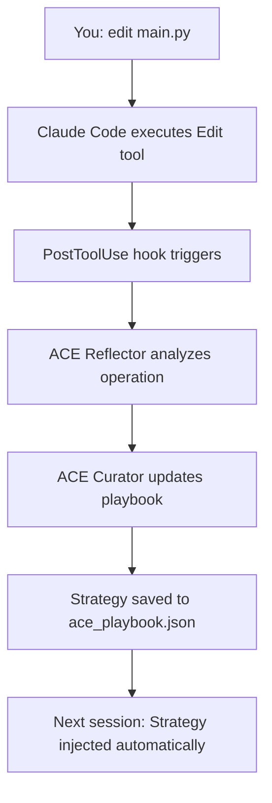

# ACE Integration with Claude Code CLI

This integration uses **Claude Code's native hooks system** to automatically inject ACE's learned strategies into your interactive Claude Code sessions and learn from successful operations.

## 🎯 How It Works

The integration uses 4 hooks that run automatically:

1. **SessionStart** - Loads learned strategies when you start `claude`
2. **UserPromptSubmit** - Injects relevant strategies for each prompt you type
3. **PostToolUse** - Learns from successful Write/Edit operations
4. **Stop** - Summarizes learning when session ends

## 📁 File Structure

```
.claude/
├── settings.json              # Hook configuration
├── ace_playbook.json          # Learned strategies (auto-created)
├── ace_sessions.log           # Session history (auto-created)
└── hooks/
    ├── ace_session_start.py   # SessionStart hook
    ├── ace_inject_context.py  # UserPromptSubmit hook
    ├── ace_learn_from_edit.py # PostToolUse hook
    └── ace_session_end.py     # Stop hook
```

## 🚀 Quick Start

### 1. Install ACE Framework

```powershell
pip install ace-framework
```

### 2. Configure API Key

```powershell
# Add to your environment or .env file
$env:OPENAI_API_KEY = "your-key-here"
```

### 3. Verify Installation

```powershell
# Make sure hooks are executable (already Python scripts)
python .claude/hooks/ace_session_start.py
```

### 4. Start Using Claude Code

```powershell
# Just use Claude Code normally!
claude
```

**That's it!** The hooks run automatically.

## 💡 What You'll See

### On Session Start

When you run `claude`, ACE automatically loads:

```
📚 ACE Learned Strategies

## Previously Helpful Strategies:
- Use TypeScript for new files
- Add error handling with try-catch
- Write unit tests for new functions
...

These strategies have been learned from previous successful 
interactions in this codebase.
```

### During Interaction

When you submit a prompt, ACE injects relevant strategies:

```
> "edit main.py to add error handling"

📚 Relevant learned strategies for this task:
- Always use try-except-finally pattern
- Log errors with structured logging
- Return error codes for CLI tools
```

Then Claude sees both your prompt AND the relevant strategies!

### After Successful Edits

When Claude successfully edits a file:

```
✅ ACE learned from Edit operation
```

The learning happens in the background - ACE's Reflector and Curator analyze the operation and update the playbook.

## 🎛️ Configuration

### Customize Hook Behavior

Edit `.claude/settings.json`:

```json
{
  "hooks": {
    "SessionStart": [
      {
        "hooks": [
          {
            "type": "command",
            "command": "python \"$CLAUDE_PROJECT_DIR/.claude/hooks/ace_session_start.py\"",
            "timeout": 30  // Increase if loading is slow
          }
        ]
      }
    ]
    // ... other hooks
  }
}
```

### Disable Specific Hooks

Comment out or remove hooks you don't want:

```json
{
  "hooks": {
    // "UserPromptSubmit": [...],  // Disabled - no per-prompt injection
    "PostToolUse": [...]  // Still learning from edits
  }
}
```

### Adjust Learning Triggers

Edit `.claude/settings.json` to learn from different tools:

```json
{
  "hooks": {
    "PostToolUse": [
      {
        "matcher": "Write|Edit|Bash",  // Also learn from Bash commands
        "hooks": [...]
      }
    ]
  }
}
```

## 📊 Monitor Learning

### View Learned Strategies

```powershell
# Run the helper script
python .vscode/ace_helper.py stats
```

Output:
```
ACE Playbook Statistics
=======================
Total strategies: 24
Helpful: 18
Harmful: 2
Neutral: 4

Top strategies:
1. Use TypeScript for new files (score: 0.85)
2. Add error handling (score: 0.78)
...
```

### View Session History

```powershell
# Check the log file
cat .claude/ace_sessions.log
```

### Inspect Playbook

```powershell
# View raw playbook JSON
cat .claude/ace_playbook.json
```

## 🔧 Troubleshooting

### Hooks Not Running

Check if hooks are registered:

```powershell
claude
> /hooks
```

You should see:
```
Registered hooks:
- SessionStart: ace_session_start.py
- UserPromptSubmit: ace_inject_context.py
- PostToolUse: ace_learn_from_edit.py
- Stop: ace_session_end.py
```

### No Context Injected

1. Check if playbook exists and has content:
```powershell
test-path .claude/ace_playbook.json
cat .claude/ace_playbook.json
```

2. Run hook manually to see errors:
```powershell
echo '{"prompt": "test"}' | python .claude/hooks/ace_inject_context.py
```

### Learning Not Working

1. Check API key is set:
```powershell
$env:OPENAI_API_KEY
```

2. Test learning manually:
```powershell
# Create test input
$input = @{
    tool_name = "Write"
    tool_input = @{
        file_path = "test.txt"
        content = "test content"
    }
    tool_response = @{
        success = $true
    }
} | ConvertTo-Json

echo $input | python .claude/hooks/ace_learn_from_edit.py
```

3. Check for errors in verbose mode:
```powershell
claude --debug
```

### Performance Issues

If hooks are slow:

1. **Increase timeouts** in `.claude/settings.json`:
```json
{
  "timeout": 60  // Increase from default 30s
}
```

2. **Disable per-prompt injection** (only use session start):
   Comment out UserPromptSubmit hook

3. **Use smaller model** for reflection (edit `ace_learn_from_edit.py`):
```python
client = LLMClient(provider="openai", model="gpt-3.5-turbo")
```

## 🎓 Advanced Usage

### Manual Learning

You can manually add learnings:

```powershell
python .vscode/ace_helper.py learn "Always use type hints in Python" --helpful
```

### Export/Import Playbook

```powershell
# Backup playbook
cp .claude/ace_playbook.json .claude/ace_playbook.backup.json

# Share with team (commit to git)
git add .claude/ace_playbook.json
git commit -m "Update learned strategies"
```

### Multiple Projects

Each project gets its own playbook in `.claude/ace_playbook.json`. Strategies are project-specific automatically.

### Custom Reflection Logic

Edit `.claude/hooks/ace_learn_from_edit.py` to customize what gets learned:

```python
# Only learn from Python files
if not file_path.endswith('.py'):
    sys.exit(0)

# Only learn from certain directories
if 'src/' not in file_path:
    sys.exit(0)
```

## 📚 Hook Events Reference

| Hook | When | Purpose |
|------|------|---------|
| SessionStart | `claude` starts | Load all learned strategies |
| UserPromptSubmit | You type a prompt | Inject relevant strategies |
| PostToolUse | After Write/Edit | Learn from successful operations |
| Stop | Session ends | Log statistics |

## 🔗 Related Resources

- [Claude Code Hooks Documentation](https://code.claude.com/docs/en/hooks)
- [ACE Framework Documentation](./docs/COMPLETE_GUIDE_TO_ACE.md)
- [VS Code Integration Guide](./VSCODE_INTEGRATION.md)

## 💭 How Learning Works



## 🎯 Best Practices

1. **Commit playbook to git** - Share learnings with your team
2. **Review learned strategies** - Periodically check what's been learned
3. **Clear bad strategies** - Remove unhelpful learnings manually
4. **Use descriptive commits** - ACE learns from git context
5. **Let it learn naturally** - Don't force-feed strategies, let ACE discover patterns

## 🚨 Important Notes

- **Playbook is project-specific** - Each `.claude/` directory has its own playbook
- **Learning is automatic** - No manual intervention needed after setup
- **Strategies persist** - Learned patterns survive across sessions
- **Non-blocking** - If hooks fail, Claude Code continues normally
- **Privacy** - All learning happens locally, only LLM API calls for reflection

## 🎉 Success Criteria

You'll know it's working when:

1. ✅ You see "ACE Learned Strategies" at session start
2. ✅ You see strategy injections for each prompt
3. ✅ You see "✅ ACE learned from Edit operation" after edits
4. ✅ The playbook file grows over time
5. ✅ Strategies become more relevant to your codebase

**Enjoy automatic learning from Claude Code!** 🚀
